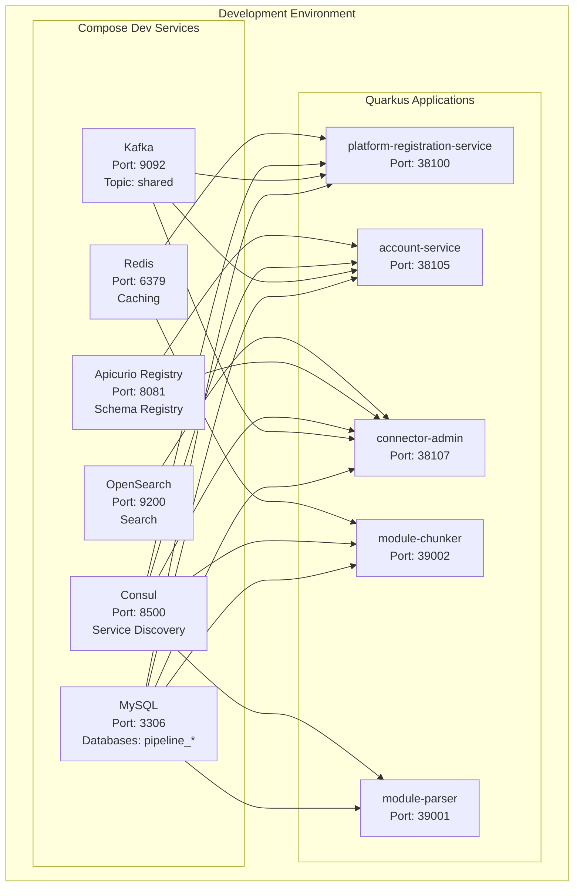
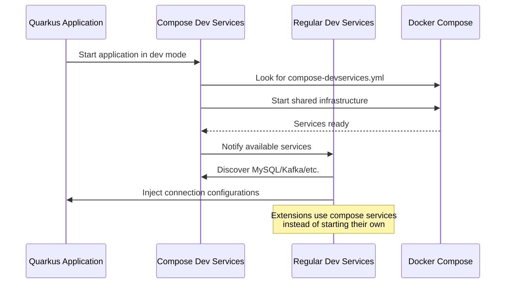
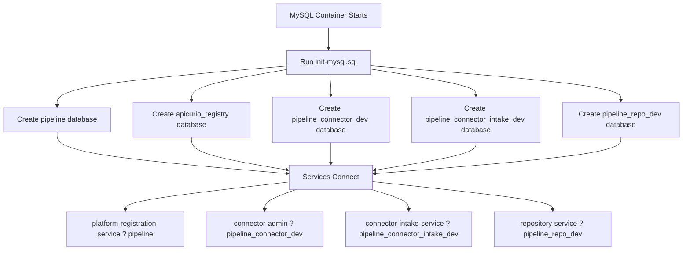
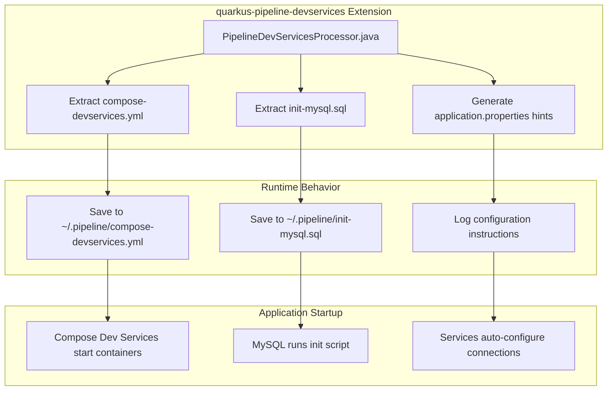

# Compose Dev Services in Pipeline Platform

## Overview

This guide explains how **Compose Dev Services** work in the Pipeline Platform development environment. Compose Dev Services provide a seamless way to run shared infrastructure services (databases, message brokers, etc.) using Docker Compose, while maintaining compatibility with Quarkus Dev Services.

## Architecture Overview



**Diagram Explanation:**
- **Compose Dev Services** run shared infrastructure containers
- **Quarkus Applications** connect to these shared services
- Services connect to only the infrastructure they need (e.g., only some services use Redis, Apicurio, etc.)
- All services share the same MySQL instance but use different databases

## How Compose Dev Services Work

### Core Concept

**Compose Dev Services** extend Quarkus Dev Services by allowing custom service definitions using Docker Compose. The key innovation is **intelligent service discovery**:



**Process Explanation:**
1. Application starts in dev mode
2. Compose Dev Services finds and starts shared containers
3. Regular Dev Services extensions discover running containers
4. Connection details are automatically injected into application properties

### Service Discovery Mechanism

Extensions identify compose services using **image names** and **exposed ports**:

| Service Type | Image Name Patterns | Port | Extension |
|-------------|-------------------|------|-----------|
| MySQL | `mysql` | 3306 | `quarkus-jdbc-mysql` |
| Kafka | `kafka`, `strimzi`, `redpanda` | 9092 | `quarkus-kafka-client` |
| Redis | `redis` | 6379 | `quarkus-redis-client` |
| OpenSearch | `elasticsearch`, `opensearch` | 9200 | `quarkus-elasticsearch` |
| Consul | `consul` | 8500 | `quarkus-smallrye-stork` |

**Discovery Logic:**
- Extension scans running containers for matching image names
- Checks if expected ports are exposed
- Extracts connection information from container metadata
- Configures application to use discovered service

## Configuration in Our Project

### Extension-Based Setup

Our `quarkus-pipeline-devservices` extension automatically handles compose file extraction:

```properties
# application.properties - Compose Dev Services Configuration

# Enable compose dev services for shared infrastructure
%dev.quarkus.compose.devservices.enabled=true

# Path to extracted compose file (managed by extension)
%dev.quarkus.compose.devservices.files=${user.home}/.pipeline/compose-devservices.yml

# Project name for container isolation
%dev.quarkus.compose.devservices.project-name=pipeline-shared-devservices

# Auto-start services when application starts
%dev.quarkus.compose.devservices.start-services=true

# Keep services running when app stops (for multi-service dev)
%dev.quarkus.compose.devservices.stop-services=false

# Reuse containers across test runs
%dev.quarkus.compose.devservices.reuse-project-for-tests=true
```

**Configuration Explanation:**
- `enabled=true`: Activates compose dev services in dev mode only (`%dev` profile)
- `files`: Points to the compose file extracted by our extension
- `project-name`: Ensures container names don't conflict between projects
- `start-services=true`: Automatically start containers when app starts
- `stop-services=false`: Keep containers running for other services to use
- `reuse-project-for-tests=true`: Speed up test execution by reusing containers

### Dev Services Fallback Configuration

```properties
# application.properties - Dev Services Fallback

# Keep regular dev services enabled for intelligent fallback
%dev.quarkus.kafka.devservices.enabled=true

# Note: datasource devservices enabled by default
# %dev.quarkus.datasource.devservices.enabled=true (implicit)
```

**Fallback Logic Explanation:**
- Regular dev services remain enabled but act as fallback
- If compose services are running ? dev services discover and use them
- If compose services aren't running ? dev services start individual containers
- No conflicts or duplicate containers

## Database Initialization Process



**Database Creation Process:**
1. MySQL container starts with volume mount: `./init-mysql.sql:/docker-entrypoint-initdb.d/init.sql`
2. MySQL runs init script on first startup
3. Creates all required databases with proper permissions
4. Services connect to their designated databases automatically

### Init Script Content

```sql
-- init-mysql.sql - Database initialization for dev services

-- Create shared pipeline database for core services
CREATE DATABASE IF NOT EXISTS pipeline;
GRANT ALL PRIVILEGES ON pipeline.* TO 'pipeline'@'%';

-- Create Apicurio Registry database
CREATE DATABASE IF NOT EXISTS apicurio_registry;
GRANT ALL PRIVILEGES ON apicurio_registry.* TO 'pipeline'@'%';

-- Create service-specific databases
CREATE DATABASE IF NOT EXISTS pipeline_connector_dev;
GRANT ALL PRIVILEGES ON pipeline_connector_dev.* TO 'pipeline'@'%';

CREATE DATABASE IF NOT EXISTS pipeline_connector_intake_dev;
GRANT ALL PRIVILEGES ON pipeline_connector_intake_dev.* TO 'pipeline'@'%';

CREATE DATABASE IF NOT EXISTS pipeline_repo_dev;
GRANT ALL PRIVILEGES ON pipeline_repo_dev.* TO 'pipeline'@'%';

-- Flush privileges to apply changes
FLUSH PRIVILEGES;
```

**SQL Script Explanation:**
- `IF NOT EXISTS`: Prevents errors if databases already exist
- `GRANT ALL PRIVILEGES`: Gives full access to pipeline user from any host (`%`)
- Separate databases ensure service isolation while sharing infrastructure

## Service Connection Examples

### MySQL Database Connection

```properties
# application.properties - Database Connection Example

# Database type
quarkus.datasource.db-kind=mysql
quarkus.datasource.username=pipeline
quarkus.datasource.password=password

# Dev mode: Connect to shared compose MySQL
%dev.quarkus.datasource.jdbc.url=jdbc:mysql://localhost:3306/pipeline_connector_dev

# Test mode: Connect to isolated test MySQL
%test.quarkus.datasource.jdbc.url=jdbc:mysql://localhost:3307/pipeline_connector_test
```

**Connection Logic:**
- Dev mode connects to shared MySQL on standard port 3306
- Each service uses its specific database name (e.g., `pipeline_connector_dev`)
- Test mode uses different port (3307) and database for isolation

### Kafka Connection

```properties
# application.properties - Kafka Connection Example

# Bootstrap servers - auto-configured by compose dev services
kafka.bootstrap.servers=${KAFKA_BOOTSTRAP_SERVERS:localhost:9094}

# Dev mode: Use shared compose Kafka
%dev.kafka.bootstrap.servers=localhost:9092

# Test mode: Use isolated test Kafka
%test.kafka.bootstrap.servers=localhost:9095
```

**Kafka Configuration:**
- Compose dev services auto-configure bootstrap servers
- Dev mode uses shared Kafka cluster on port 9092
- Test mode uses isolated Kafka on port 9095

## Extension Architecture



**Extension Workflow:**
1. **Build Time**: Processor extracts files and logs configuration
2. **Runtime**: Compose starts containers using extracted files
3. **Service Discovery**: Extensions find and configure connections
4. **Database Init**: MySQL creates databases on first startup

### Key Extension Features

- **File Extraction**: Bundles compose files in JAR, extracts to user directory
- **Version Management**: Tracks SHA to detect updates
- **Auto-update**: Updates files when extension version changes
- **Configuration Logging**: Tells developers exactly what properties to add
- **Non-intrusive**: Only runs in dev mode, zero production overhead

## Troubleshooting

### Common Issues

**Issue: Services can't connect to database**
```bash
# Check if MySQL is running
docker ps | grep mysql

# Check MySQL logs
docker logs pipeline-mysql

# Verify database exists
docker exec -it pipeline-mysql mysql -u pipeline -ppassword -e "SHOW DATABASES;"
```

**Issue: Port conflicts**
```bash
# Check what's using ports
lsof -i :3306
lsof -i :9092

# Stop conflicting containers
docker stop <container-id>
```

**Issue: Old compose file version**
```bash
# Force update by deleting extracted files
rm ~/.pipeline/compose-devservices.yml
rm ~/.pipeline/init-mysql.sql
rm ~/.pipeline/.version

# Restart application to re-extract
```

### Debug Commands

```bash
# View running containers
docker ps --filter "name=pipeline-"

# Check container logs
docker logs pipeline-mysql
docker logs pipeline-kafka

# Inspect container networks
docker network ls
docker network inspect pipeline-shared-devservices_default

# Check MySQL databases
docker exec -it pipeline-mysql mysql -u pipeline -ppassword -e "SHOW DATABASES;"

# Check Kafka topics
docker exec -it pipeline-kafka /opt/kafka/bin/kafka-topics.sh --bootstrap-server localhost:9092 --list
```

## Benefits of This Approach

1. **Shared Infrastructure**: All services use same databases/message brokers
2. **Production-like Setup**: Mirrors actual deployment architecture
3. **Resource Efficient**: Single containers instead of per-service instances
4. **Fast Development**: Services can be started independently
5. **Zero Configuration**: Automatic service discovery and connection setup
6. **Test Isolation**: Separate compose files for test environments
7. **Fallback Safety**: Dev services provide automatic fallbacks

## Migration Notes

When adding new services to use compose dev services:

1. Add `quarkus-pipeline-devservices` dependency
2. Configure compose dev services properties
3. Update `init-mysql.sql` if new databases needed
4. Test with shared infrastructure
5. Add start script following the pattern

This setup provides the best of both worlds: shared, production-like infrastructure with the convenience and safety of automatic fallbacks.